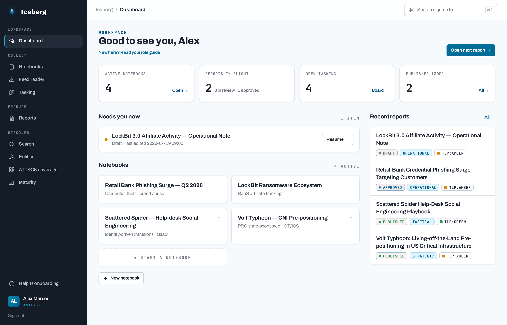
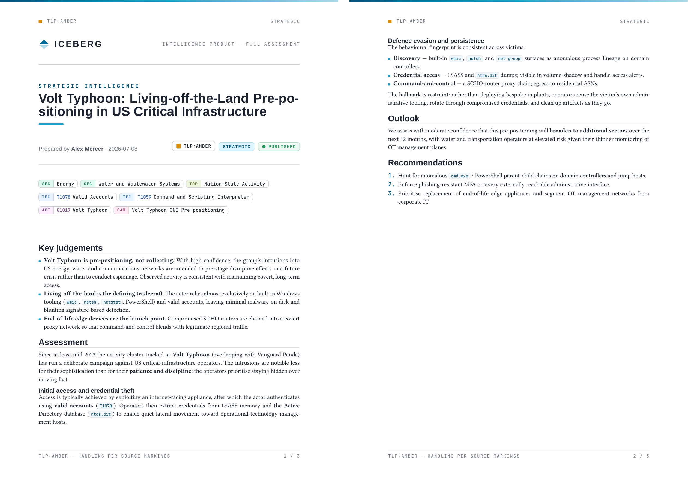

Cyber threat intelligence

Collect. Author. Disseminate.

Iceberg is a CTI platform built around the intelligence cycle: analysts collect
sources into topic **notebooks**, author finished **intelligence products** in
markdown, and **disseminate** them to stakeholders matched by intelligence level
and TLP — with the whole loop closed by stakeholder feedback.

[The intelligence cycle](workflow.md){ .md-button .md-button--primary }
[Deploy it](deployment.md){ .md-button }
[View on GitHub](https://github.com/IcebergAI/IcebergCTI){ .md-button }

## Why Iceberg

Most CTI tooling is an indicator database with a report feature bolted on.
Iceberg inverts that: it is a **finished-intelligence platform** — the
authoritative IOC store stays external (MISP) — built for the analysts who
write, the reviewers who gate, and the stakeholders who consume. Reports carry
an intelligence level (Strategic / Tactical / Operational), a TLP marking,
Admiralty-graded sources, and structured analytic techniques, and they move
through a review workflow to a frozen, immutable publication.

-   :material-notebook-outline: __Notebook-based collection__

    ---

    Open a topic notebook, gather sources, notes, and uploaded attachments;
    stage light-touch IOCs; apply the Diamond Model and ACH with live inline
    embeds.

    [:octicons-arrow-right-24: Collection](workflow.md#collect)

-   :material-file-document-edit-outline: __Author finished products__

    ---

    A full-height markdown editor with live preview, source citations,
    requirement traceability, taxonomy tagging, and branded Typst PDF
    rendering.

    [:octicons-arrow-right-24: Authoring](workflow.md#author)

-   :material-send-check-outline: __Dissemination that closes the loop__

    ---

    On publish, reports match stakeholders by preferred intel level + TLP into
    a personal feed with email notification; feedback and RFI satisfaction
    flow back to analysts.

    [:octicons-arrow-right-24: Dissemination](workflow.md#disseminate)

-   :material-clipboard-list-outline: __Requirements → tasking__

    ---

    Stakeholders record PIRs, GIRs and RFIs; analysts work them from a
    tasking board with coverage gaps and traceability from requirement to
    published product.

    [:octicons-arrow-right-24: Tasking](workflow.md#task)

-   :material-shield-lock-outline: __Governed by design__

    ---

    Multi-provider OIDC SSO, role-based access, TLP-gated egress for AI, MISP
    and dissemination, a structured audit log with SIEM forwarding, and
    hardened outbound fetching.

    [:octicons-arrow-right-24: Security](security.md)

-   :material-connection: __Plays well with your stack__

    ---

    MISP push, read-only TAXII 2.1 serving, TAXII/MISP pull, RSS ingestion,
    ATT&CK Navigator layers, governed AI assist, publication webhooks, and a
    global outbound proxy.

    [:octicons-arrow-right-24: Integrations](integrations.md)

## The product, not the pipeline

Everything converges on the finished report: TLP and intelligence-level
markings, numbered citations, an indicators appendix, inline Diamond/ACH/figure
embeds, and one-click PDF products typeset with Typst.

