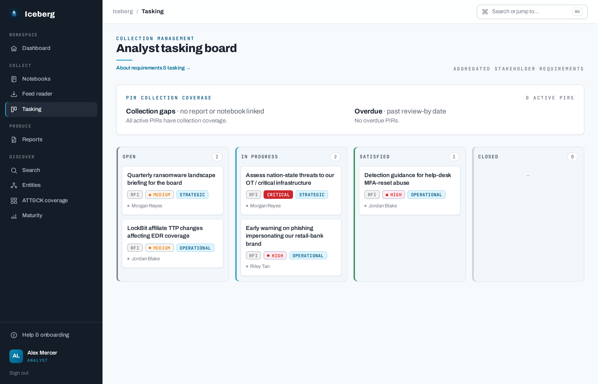
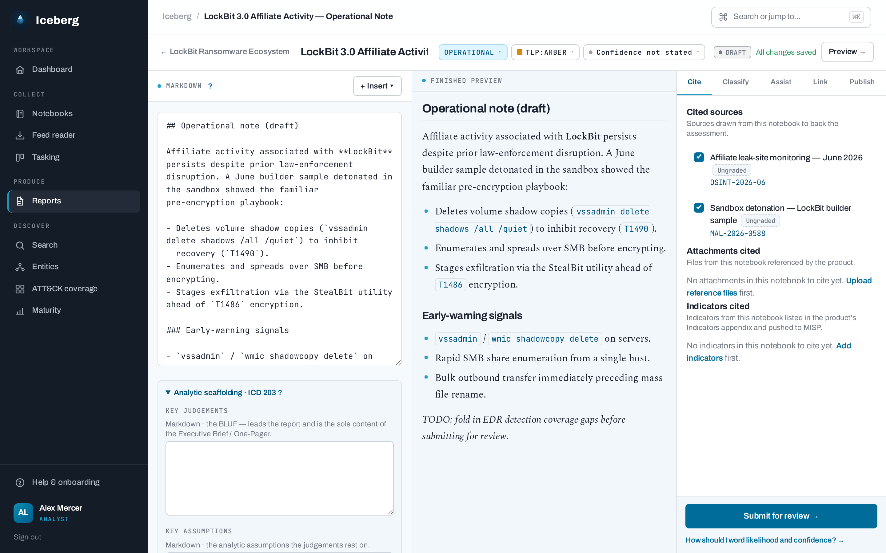
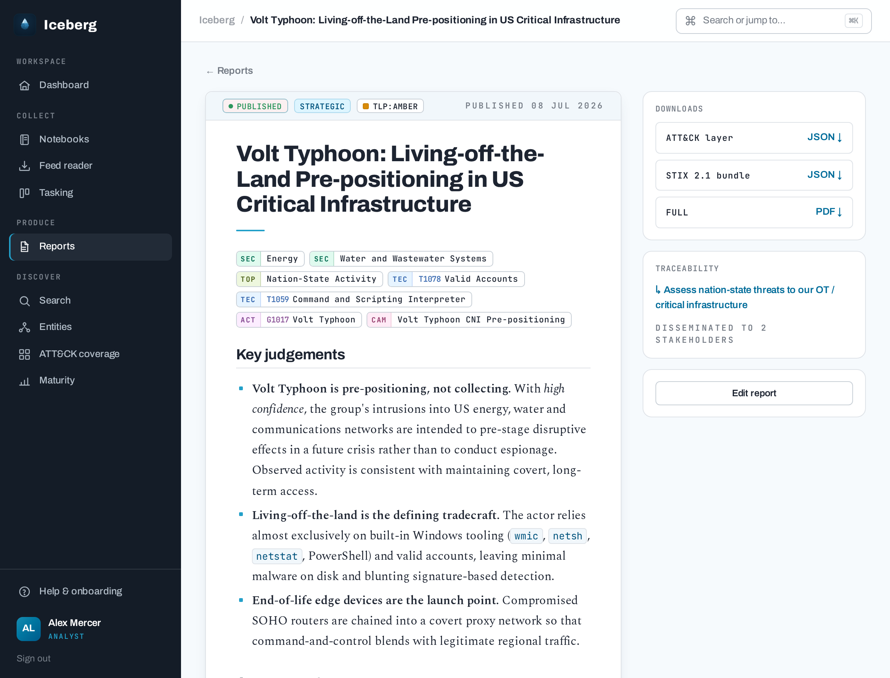
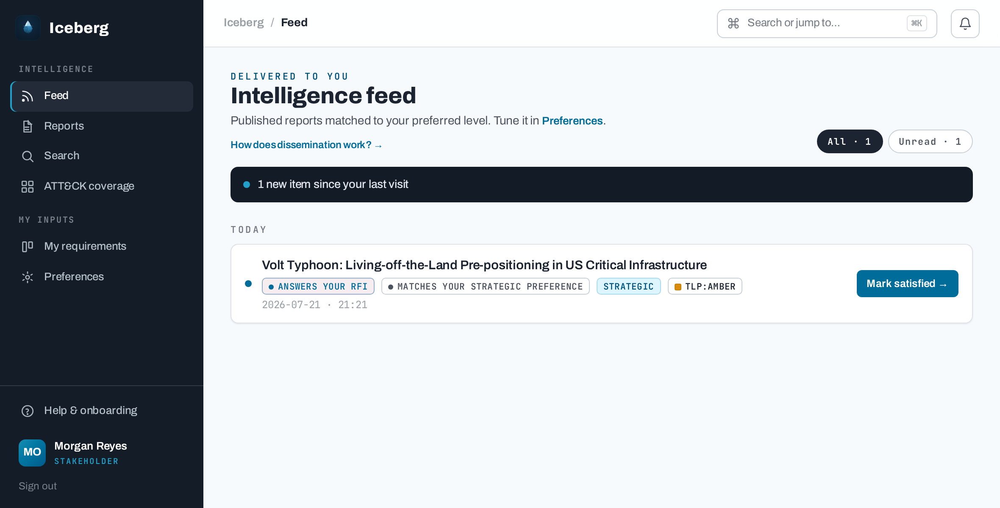

# The intelligence cycle

Iceberg follows the traditional intelligence cycle — direction, collection,
analysis, production, dissemination, feedback — with a screen for each phase
and traceability across all of them.

## Direction: requirements and tasking { #task }

Stakeholders (read-only users) record their own intelligence requirements,
typed by how they direct work:

| Type | Meaning | Shape |
|---|---|---|
| **PIR** | Priority intelligence requirement | Decision-tied, time-bound, carries priority |
| **GIR** | General intelligence requirement | Standing collection interest |
| **RFI** | Request for information | Ad-hoc question, satisfied by a specific product |

Requirements aggregate into a **tasking board** grouped by status. Ordering
blends urgency and kind — a PIR is floored to at least High priority so it
leads standing work, but a genuine Critical item still tops its column. A PIR
coverage panel flags PIRs with no linked report or notebook (collection gaps)
and those past their review-by date.

## Collection: notebooks { #collect }

Analysts open a topic **notebook** and gather material into it:

- **Sources** — links and references, graded with an offline Admiralty/NATO
  reliability heuristic; manual sources default to TLP:AMBER.
- **Notes** — free-form analyst notes.
- **Attachments** — uploaded reference files (MIME-whitelisted, size-capped,
  magic-byte validated).
- **Light-touch IOCs** — indicators staged as notebook entities for later
  citation and MISP push. Iceberg is *not* an IOC store; the authoritative
  store stays external.

Collection is fed from outside too: an admin-configured **RSS/Atom reader**
lets analysts send an article to a notebook as an auto-graded source, and
writers can pull from **TAXII 2.1** and **MISP** servers directly into
notebook sources and IOCs.

## Analysis: structured techniques

Inside a notebook, analysts apply structured analytic techniques whose
artefacts embed live into reports:

- **Diamond Model** of intrusion analysis diagrams
- **Analysis of Competing Hypotheses (ACH)** matrices
- **Figures** — uploaded images with captions

Inline-embed tokens (`[[diamond:ID]]`, `[[ach:ID]]`, `[[figure:ID]]`, and a
bare `[[attack]]` coverage matrix) resolve in the live preview, the published
web view, and the PDF. Tokens are notebook-scoped — a cross-notebook or
unknown id degrades to an "unavailable" notice rather than leaking content.

## Production: authoring and review { #author }

One or more **reports** (intelligence products) are authored from a notebook's
material in a full-height three-pane editor: markdown, live preview, and a
docked panel for citations, tags, requirement links, and rendering.

Reports carry:

- an **intelligence level** — Strategic, Tactical, or Operational — used for
  dissemination matching;
- a **TLP marking** — a display and routing marking, never an in-portal read
  gate;
- **citations** of notebook sources and attachments, rendered as numbered
  references;
- **cited indicators**, rendered as an Indicators appendix;
- **taxonomy tags** — threat actor, campaign, malware, ATT&CK technique,
  sector, topic — driving faceted search, entity profiles, and an ATT&CK
  coverage heatmap;
- an advisory **estimative-language lint** (tradecraft nudges, never a block).

Products render on demand to **branded PDFs** via Typst in three formats —
full assessment, executive brief, one-pager — independent of intel level.

Reports move Draft → In review → Approved → **Published**. Publishing freezes
an immutable **publication snapshot**: stakeholder views, PDFs and MISP pushes
all serve from the snapshot, never from live notebook material.

## Dissemination: the stakeholder feed { #disseminate }

On publish, a report is matched to stakeholders by their **preferred
intelligence level** and **TLP ceiling** and delivered to a personal feed,
with optional email notification and tag-subscription webhooks. Each feed item
explains *why* it was delivered — an answered RFI and a preference match are
reported separately.

## Feedback: closing the loop

On a delivered product, a stakeholder leaves **feedback**: a usefulness
rating, an optional **RFI-satisfaction verdict** against one of their own
requirements, and a comment. A *Met* verdict from the owning stakeholder
auto-advances that requirement to Satisfied — closing the cycle. Feedback
surfaces on the report for authors and on the requirement for analysts, and
rolls up into a writer-only **program maturity dashboard** of CTI-CMM-style
health indicators.
